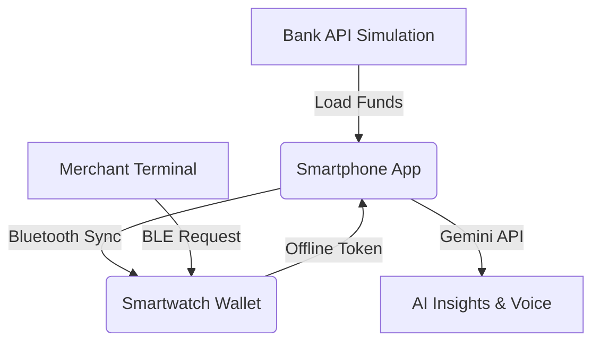

# ZiPPaY ⚡️

> **A high-fidelity, offline-first smartwatch micro-payment prototype powered by React 19, Spline 3D, and Google Gemini AI.**


**ZiPPaY** bridges the gap between traditional UPI apps and wearable technology. It simulates a complete ecosystem—Smartphone, Smartwatch, and Merchant Terminal—focusing on speed ("ZiP"), accessibility (Blind Mode), and reliability in low-connectivity environments.

---

## 📱 The Ecosystem

ZiPPaY operates as a distributed system simulation across three distinct interfaces:

### 1. Smartphone App (The Command Center)
The primary hub for managing funds, analyzing spending, and configuring the wearable.
*   **Visual Analytics**: Interactive charts (Area, Candles, Trend Lines) powered by SVG.
*   **AI Coach**: A Gemini-powered financial assistant that proactively analyzes spending habits and anomalies.
*   **Wallet Management**: Load money to the watch, set daily limits, and toggle auto-reload.
*   **Accessibility**: "Blind Mode" toggle that activates full Voice Control.

### 2. Smartwatch Interface (The Transaction Edge)
A realistic Wear OS simulation designed for 1-tap micro-payments, featuring an **interactive 3D Spline model**.
*   **3D Visualization**: High-fidelity 3D watch model powered by Spline for immersive realism.
*   **Circular UI**: Optimized for round displays with gesture support (Swipe up to pay).
*   **Offline Mode**: Stores up to 5 transactions locally when disconnected from the phone.
*   **Haptic Feedback**: Distinct vibration patterns for success, error, and alerts.
*   **Emergency ZiP**: Allows overdrafting for critical payments (with a 4% convenience fee).

### 3. Merchant Hub (The Point of Sale)
A tablet-sized interface for vendors to initiate requests.
*   **Proximity Detection**: Simulates Bluetooth Low Energy (BLE) connection when the watch is "active".
*   **Payment Requests**: Keypad interface to request specific amounts.
*   **Instant Settlement**: Visual feedback when funds are received.

---

## 🤖 AI & Accessibility Features

ZiPPaY integrates **Google Gemini Multimodal Live API** to provide a truly inclusive financial experience.

### 🗣️ Blind Mode & Voice Control
Activated via the User Profile, this mode transforms the app into a voice-first experience.
*   **Wake Word**: "Hey Zip"
*   **Commands**:
    *   _"What is my balance?"_
    *   _"Load 200 rupees"_
    *   _"Pay 50"_ (Context-aware: matches pending merchant requests)
    *   _"Analyze my spending"_
*   **Feedback**: Uses Gemini TTS (Text-to-Speech) for human-like auditory confirmation of every action.

### 🧠 Proactive AI Coach
The AI Assistant doesn't just answer questions; it scans your `GlobalState`:
*   Detects "Debt spirals" (frequent Emergency ZiP usage).
*   Suggests daily limits based on spending velocity.
*   Flags unusual transaction amounts.

---

## 🛠️ Architecture & Workflow

The app uses a unified `GlobalState` to simulate a local network of devices.



### Key Workflows

1.  **Top-Up Flow**:
    *   User loads ₹500 on Phone.
    *   Checks for Wifi + Bluetooth.
    *   Syncs balance to Watch State.

2.  **Payment Flow**:
    *   Merchant enters ₹150.
    *   Watch vibrates (Haptic) and shows request.
    *   User taps "Check" or says "Pay 150".
    *   **Logic**: If `Balance < Amount`, check `Emergency Eligibility`.
    *   **Result**: Success Tone + Haptic Pulse.

3.  **Offline Sync**:
    *   Watch performs transactions without phone.
    *   Offline Counter increments (Max 5).
    *   User returns to Phone -> Taps "Sync".
    *   Ledgers merge.

---

## 🚀 Getting Started

### Prerequisites
*   Node.js 18+
*   Google Gemini API Key

### Installation

1.  **Clone the repo**
    ```bash
    git clone https://github.com/your-username/zippay.git
    cd zippay
    ```

2.  **Install dependencies**
    ```bash
    npm install
    ```

3.  **Set up Environment**
    Create a `.env` file in the root:
    ```env
    VITE_GOOGLE_API_KEY=your_gemini_api_key_here
    ```

4.  **Run the Prototype**
    ```bash
    npm run dev
    ```

---

## 💻 Tech Stack

*   **Framework**: React 19 (Hooks, Context, Refs)
*   **3D Graphics**: Spline (`@splinetool/react-spline`)
*   **Styling**: Tailwind CSS (Animation utilities, Gradients)
*   **AI**: Google GenAI SDK (`@google/genai`)
*   **Audio**: Web Audio API (Oscillators for custom UI sounds)
*   **Haptics**: `navigator.vibrate` API
*   **Build Tool**: Vite

---

## 📸 UI Showcase

| Smartphone | Smartwatch | Merchant |
|:---:|:---:|:---:|
| Deep Analytics & Controls | Wear OS Simulation | POS Terminal |
| *Spending Charts, Profile, AI Chat* | *Circular UI, Gestures, Alerts* | *Keypad, Ledger, Status* |

---

*Built for the Google Gemini Developer Competition.*
